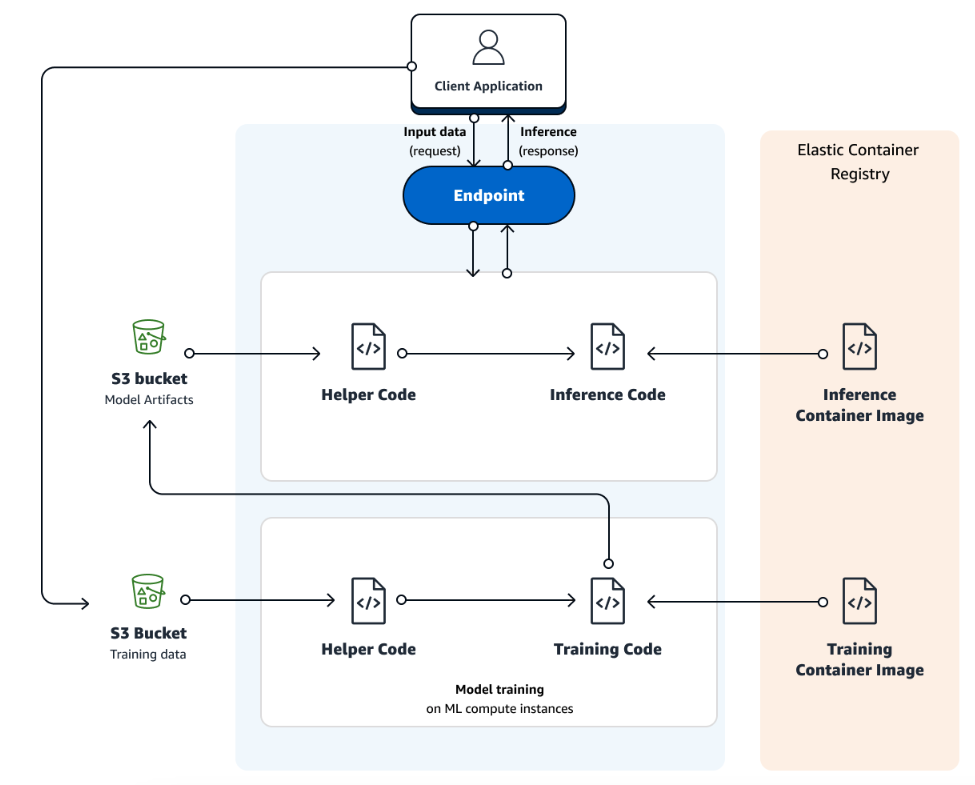

# Sagemaker 快速訓練/部署模型

使用到的功能：
1. Notebook Instance
2. Ground Truth (用來標記資料)
3. Training jobs (訓練及建立模型)
4. Endpoint

#### 整套流程

1. 資料標記（Ground Truth） -> 上傳 S3
2. 模型訓練（training jobs），使用 S3 上的 JSON Lines 檔案以及內建模型
3. 部署模型 (Endpoint)
   1. 設定端點組態（Configuration），使用無伺服器彈性高的端點，可自動根據流量增減。
   2. 部署模型，建立一個端點，選擇設定好的組態＋訓練好的模型
4. End

## 資料（準備，前處理，標記，儲存）

### 資料準備

直接把準備好的資料放到 S3，等等標記時指向 S3 即可。

可以參考以下的官方範例：
<details><summary>官方範例</summary>
建立一個 Notebook Instance（或其他可以 access 到 aws 的環境，包含local terminal、local python file 等等，只要可以 access 都可以）

以 Sagemaker Notebook Instance 為例，建立 notebook instance 後，開啟一個 .ipynb file，執行以下程式，正常執行後即把資料 download 到 S3 了。
```python
import sagemaker

sess = sagemaker.Session()
bucket = sess.default_bucket()

!aws s3 sync s3://sagemaker-sample-files/datasets/image/caltech-101/inference/ s3://{bucket}/ground-truth-demo/images/

print('Copy and paste the below link into a web browser to confirm the ten images were successfully uploaded to your bucket:')
print(f'https://s3.console.aws.amazon.com/s3/buckets/{bucket}/ground-truth-demo/images/')

print('\nWhen prompted by Sagemaker to enter the S3 location for input datasets, you can paste in the below S3 URL')

print(f's3://{bucket}/ground-truth-demo/images/')

print('\nWhen prompted by Sagemaker to Specify a new location, you can paste in the below S3 URL')

print(f's3://{bucket}/ground-truth-demo/labeled-data/')
```
</details>

或手動把資料放入 S3：
1. 我們上網隨便搜尋 5 張包含人臉的照片，以存於[這邊](../data/)。
2. 把這 5 張包含人臉的照片放入指定的 S3（這裡不多做介紹，自己放進自己帳號的 S3 bucket，只要記得放在哪即可）

### 資料標記

#### Ground Truth -> Labeling jobs -> Create labeling jobs

選擇預先建立好的 S3 位置，任務類型選擇 bounding box。

**任務描述類型請詳盡清楚，後續 AWS 將會派遣人力資源幫你標記。**

預設是 5 個人力幫忙標記資料，計價方式假設是以此例子來做說明：
- 資料筆數: 5 份
- 審查費用區間: 5 筆資料 < 50000，因此費用為 0.08 USD
- 任務費用: 0.036 USD/每份資料
  
因此本次任務的費用為：任務費用＋審查費用（必須）
- 任務費用 = 0.036 * 5 (5 張圖片) * 5 (5 個標籤人員) = 0.9
- 審查費用 = 0.08 * 5 (5 張圖片，若超過 50000 張圖片，則多的圖片以 0.04 計價) = 0.4
- 總共 = 0.9 + 0.4 = 1.3 （換算成台幣約為40元）

計價表：https://aws.amazon.com/tw/sagemaker/data-labeling/pricing/

標記完後選擇「輸出資料及位置」，即可看到標記完資料儲存的 S3 位置，點選：manifests/output/output.manifest，此為 output 的 JSON Lines 格式的輸出資料。

--- 

## 模型訓練

Sagemaker ML 任務整體服務框架如下：



將資料準備好後，我們即可開始訓練模型，Sagemaker 可選擇的訓練模型方式是：
1. 使用內建演算法（基本任務都有，基本上只要是來自 Ground Truth 標記完的資料都能無痛串接，最快最方便）
2. 自定義演算法（較為客製化的訓練方式，例如串接 LoRA 等等模塊）
3. 自己準備 Container（按照 Sagemaker 準備好後，放到 ECR，[參考](https://docs.aws.amazon.com/zh_tw/sagemaker/latest/dg/docker-containers.html）
4. 其他內建演算法

在 Sagemaker 主控台左側，選擇「培訓」->「訓練任務」->「建立訓練任務」


在[這邊](https://docs.aws.amazon.com/zh_tw/sagemaker/latest/dg/algos.html)找到最適合的演算法或業務情境，決定是否使用內建的演算法，或是自己建立訓練演算法，以物件偵測為例，參考[這邊](https://docs.aws.amazon.com/zh_tw/sagemaker/latest/dg/object-detection.html)會詳細說明所需要的 input 格式。**因此針對個案，每次建立新的訓練任務，都要閱讀官方提供的資料格式。**

### 設定參數部分


1. 這裡使用 Sagemaker 內建的演算法：Vision - Object Detection (MxNet)
2. 往下拉看到「輸入資料組態」內的設定如下：
   - 這個 Channel 可以幫助區分「訓練、測試、驗證」等資料集，此範例我們只使用兩個 channel：「train」、「validation」（針對不同演算法或任務，有各自的規定）。
   - 
   - 
    - 屬性名稱「AttributeNames」，主要需要是輸入演算法的內容。
3. S3 位置則設定為使用 Ground Truth 標記完的 output.manifest 位置（確保此檔案的 key 能正確對應到上圖的 AttributeNames）。
4. 「紀錄包裝函式」RecordWrapperType 選擇「RecordIO」

更多詳細的選項說明可以參考[這邊](https://docs.aws.amazon.com/zh_tw/sagemaker/latest/dg/augmented-manifest.html)


其他參數我並沒有做太大的變動，這個[部落格](https://aws.amazon.com/tw/blogs/machine-learning/accelerate-model-training-using-faster-pipe-mode-on-amazon-sagemaker/)有提供 Pipe 的說明，可以再做參考，之後建立訓練後就等於直接開始跑訓練了。

回到此任務 -> 狀態 -> 檢視歷史紀錄，出現以下畫面就代表成功了！


失敗的話可以從 Cloudwatch 或是 [這邊](https://docs.aws.amazon.com/sagemaker/latest/dg/clarify-processing-job-run-troubleshooting.html)細查原因。


訓練指標可以參考頁面往下（CloudWatch），可以看到一些評估指標，點進 log 也可以看到 loss 等等資訊。

---

## 模型部署

在 Sagemaker 中，想要部署模型到雲端，可使用「endpoint」，整體服務概念如下：


<details><summary>AWS Gateway 說明</summary>

---

簡單來說 AWS Gateway 就是類似 [Proxy](https://zh.wikipedia.org/zh-tw/%E4%BB%A3%E7%90%86%E6%9C%8D%E5%8A%A1%E5%99%A8) 的功能。扮演 Client 和 Server 的中間角色。

假設一個 http 網址是 my_host.com/my_resource/my_data

Client 希望透果此網址訪問 my_host 會依照以下步驟進行：
1. 先由 DNS 將 host 轉成 IP 位置，例如 my_host.com -> 172.0.0.1
2. 接著知道 IP 後，由 Load Balancer 幫忙這些 Server 做分流（平均分散每個訪問流量）
3. Server 接到 request 後開始解析。導向 my_resource/my_data 的位置。
4. 回傳結果

以上會遇到幾個問題：
1. 如果今天有駭客發起網路攻擊，導致 Load Balance 無法負荷怎麼辦？
2. 如果今天的訪問有一半要求的資源都不存在，例如 my_resource/my_data，豈不是平白佔用 Server 流量？
3. 如果我訪問的封包在中途被駭客擷取？

實務上還會有更多問題，以安全性的角度切入，才會有 Proxy 出現。而 AWS Gateway 做的事情也相當類似，也能夠加密傳輸協定，並且 **AWS Gateway 主要是將訪問導向 AWS 對應的服務**，可以想像上述原本要在 Server 端處理的解析訪問資源（第二點），在架構前端的 Gateway 就先處理掉，不僅加速整個流程，也不會讓 Server 處理沒必要的瑣事。

總結：AWS Gateway 主要負責將 request 轉向 AWS 各個資源，也做到安全性的加密與保護，因此通過 Gateway 的流量，基本上都能鎖定到正確的服務，來源也「稍微」安全，而 Load Balancer 不管安全性，只負責做分流。因此想像 AWS Gateway 像是展覽安保人員，他會知道帶槍的不能進去，工作人員可以進後門，一般路人只能走大門，而 Load Balancer 是展覽工讀生，只負責管走大門的客人，顧客是誰他不管，他只被交代什麼時間點誰能放人進去，能進去哪個攤位。

---

</details>

基本上可以大致把整個 Serving 流程想像成：**客戶向雲端發出請求 -> 通過 GateWay 整合請求來導向不同的雲端服務 (管理、整合、過濾不同請求) -> 觸發 Lambda 後會轉發給 Sagemaker 模型做推論 -> Sagemaker 的 Autoscaling 會根據 Lambda 的請求流量來自動擴增縮減計算資源（越多請求擴增越多計算資源）-> 推論完後再由 Lambda, Gateway 回傳給客戶模型預測的結果。**

Sagemaker Serving 的方式可以分成以下三種：
1. 即時同步推論：想像有台機器 24 小時不斷電為客戶服務。價錢當然也是 24 小時計算。例如：自駕車需要隨時將路況資訊傳遞給 AWS object dection 模型，周圍物體面積與距離，並計算當前最恰當時速，這種「即時性、頻率高」的服務適合此方案。
2. 非同步推論：想像有一台機器，需要用到的時候才會啟動，執行完會把結果存在雲端上，客戶要用再自己查詢，而機器沒用到時可以做其他事情，便是非同步推論。例如：IC 大廠，每日產線可能都製造一百萬張晶片，需要透過模型預測晶片是否異常，因此**輸入資料極大**，推論需要花較長時間，則適合此方案。
3. 無伺服器：相像有一台機器，需要用到的時候才會啟動，但執行完後會立刻回傳給客戶，因此客戶需要等待啟動時間以及推論時間。適合流量間歇性的服務（因為沒有 GPU，不適合大模型）。

### 建立端點

首先需要建立[端點組態（configuration）](https://docs.aws.amazon.com/zh_tw/sagemaker/latest/dg/serverless-endpoints-create.html#serverless-endpoints-create-config)，選擇 推論 -> 模型 -> 選擇自己的模型 -> 建立端點組態


端點類型可選擇：
-  已佈建（Real-time Endpoint）: 相當於一直開著一台機器等著被請求，因此可達到**高效率、低延遲**等即時性功用，相對也會持續計算費用，也需要手動啟動、刪除端點，當然也支援 Autoscaling 功能以節省成本。
-  無伺服器（Serverless Endpoint）: 相當於需要時系統自動擴增縮減計算個體（Autoscaling），但最大的缺點就是端點最大只能設定 6G 的記憶體，某些情況下模型可能無法使用。單一端點最大並行（同時請求）數量為 200，同一區域最大端點數為 50，應此在完全相同時間內可同時存在 10000 個請求，並且**不支援 GPU**。

這裡選擇「無伺服器端點」-> 變體選擇剛才訓練好的模型 -> 編輯（4 GB 記憶體）-> 建立端點組態

接下來選擇建立端點 -> 選擇剛才建立好的端點組態 -> 建立端點（大約要等個幾分鐘）

建立好後即可進行服務！

Note: 無伺服器端點費用：每秒成本 * Inference 秒數


<details><summary>詳細計價範例（Real-time Endpoint）</summary>

同步推論相當於直接開好機器等著請求，價錢計算和自己手動建構 ec2 作為 server 並無太大差別

計價分成：模型託管費用＋流量託管費用（若有監控模型則需另計）

假設使用 `ml.g4dn.4xlarge` 的計算個體來部署模型，並且部署 `4` 個計算個體做 Serving，每天假設接收到 100MB 的資料流量，回應（回傳推論結果）大小為 10M，因此得到：

- 每天 `24` 小時
- 共 `31` 天
- 機器定價每小時為 `1.505` 美元
- 共 `4` 個計算個體
- 每 GB 資料輸入或輸出的費用為 `0.016` 美元

則一個月費用為：

- 模型託管費用＝24小時 * 31天 * 1.505 * 4台個體 = 4478.88 USD
- 流量託管費用＝請求費用＋回應費用
  - 請求費用＝31天 * 0.1GB * 0.016 = 0.0496
  - 回應費用＝31天 * 0.01GB * 0.016 = 0.00496
- 一個月費用＝4478.88 + 0.0496 + 0.00496 = 4478.93456 USD
  

**換算台幣約為 13.5 萬左右，因此一年需要 160 萬台幣。**

當然，可以進一步設定 [Autoscaling](https://aws.amazon.com/tw/blogs/machine-learning/configuring-autoscaling-inference-endpoints-in-amazon-sagemaker/)，自動根據流量縮放計算個體。

</details>

### 模型推論

建立好端點後，使用 Python 進行 API 呼叫，輸入格式參考[這裡](https://docs.aws.amazon.com/zh_tw/sagemaker/latest/dg/cdf-inference.html)，統一使用二進位的資料格式或序列數值化資料。

```python
import boto3
import json

runtime = boto3.client("sagemaker-runtime", region_name="your_region")
endpoint_name = "your_name"

with open("./inference_data/face1.jpeg", "rb") as image:
    f = image.read()
    b = bytearray(f)
    endpoint_response = runtime.invoke_endpoint(EndpointName=endpoint_name, ContentType="image/jpeg", Body=b)
    results = endpoint_response["Body"].read()
```

如此便完成模型推論，詳細模型輸入的格式

輸出格式：https://docs.aws.amazon.com/zh_tw/sagemaker/latest/dg/object-detection-in-formats.html

串接 API 讓使用者能夠透過一般的方式呼叫，可以參考[這篇](https://medium.com/hackernoon/building-realtime-object-detection-api-with-amazon-sagemaker-and-amazon-api-gateway-c9f62a9fd69a)。
基本上就是用一個 Lambda 包起來，將上述 Inference 程式實作在 Lambda 內，而 Lambda 吃的參數是圖片的 url，在程式內轉碼即可。

---
## 總結

本文示範了如何把模型做到最簡單的 Serving，費用上因為是 **Servrless Inference** 所以是有人 request 才會計費。這種方式適合流量不穩定，計算開銷不用特別大的服務，若有已知大流量需要服務則可以使用 **provisioned concurrency**。因此，如果模型不大，推論不需要 GPU，則推薦 Serverless 方式，相反，就只能使用 Real-time inference，再透過 autoscaling 控制成本。

而上述範例的每個部分，大多都可以看成獨立的部分，換言之，就是可以使用 Sagemaker 的方法，也可以使用自己的方法，就以標記而言，當然可以自己使用已標記好或開源框架（Label Studio），只需將格式轉換就能套在訓練流程。

產品化會有更多考量的點，例如：
1. 模型迭代 CI/CD 要如何處理？如何更新部署？
2. 模型持續訓練，要如何達到自動化第一點？
3. 流量限制？資安議題？要如何在 API 上設定安全防線
4. A/B 測試？要如何客製化分配流量在不同端點？
5. 模型更新時，Serving 當下要怎麼做到無痛接軌？
6. 模型 Inference 過程，如何做到連接資料庫？
7. 模型自動 Serving 過程中，有哪些 trigger，觸發自動的功能有哪些？（training? inference?）
8. Serving 過程中，串接此 API ，前台系統需要給哪些參數，需要埋哪些 log？
9. A/B 測試過程中，要如何定義指標來評估模型？使用者回饋？系統點擊率？系統日活/月活量？
10. Serving 過程發生例外時，要怎麼處理？回傳 default 值？
11. 流量不固定要使用 Autoscaling?預設 Serve 要幾台？整體框架 cost?

若有興趣知道上述的問題，可以參考另一篇 [Machine Learning Serving Example by AWS](https://github.com/kiangkiangkiang/Machine-Learning-Serving-Example-by-AWS)，推薦給對雲端服務有基本認知，對機器學習有基本認知，對模型服務有興趣的人！
---
## 參考

1. 資料標記：https://aws.amazon.com/tw/getting-started/hands-on/machine-learning-tutorial-label-training-data/
2. 使用 Ground Truth 標記資料訓練：https://aws.amazon.com/tw/blogs/machine-learning/easily-train-models-using-datasets-labeled-by-amazon-sagemaker-ground-truth/
3. Sagemaker 演算法：https://docs.aws.amazon.com/zh_tw/sagemaker/latest/dg/algorithms-choose.html
4. Sagemaker 訓練任務：https://docs.aws.amazon.com/zh_tw/sagemaker/latest/dg/how-it-works-training.html
5. Sagemaker 建立端點：https://docs.aws.amazon.com/sagemaker/latest/APIReference/API_CreateEndpoint.html
6. **很多 AWS 相關的筆記（強烈推薦）**：https://godleon.github.io/blog/
7. Sagemaker 計價資訊與範例：https://aws.amazon.com/tw/sagemaker/pricing/?p=pm&c=sm&z=4
8. Sagemaker 非同步推論：https://docs.aws.amazon.com/zh_tw/sagemaker/latest/dg/async-inference.html
9. Sagemaker 無伺服器推論：https://docs.aws.amazon.com/zh_tw/sagemaker/latest/dg/serverless-endpoints.html
10. Sagemaker 呼叫端點：https://docs.aws.amazon.com/zh_tw/sagemaker/latest/APIReference/API_runtime_InvokeEndpoint.html
11. Sagemaker 內建演算法：https://docs.aws.amazon.com/zh_tw/sagemaker/latest/dg/algos.html
12. 流量測試：https://aws.amazon.com/tw/blogs/machine-learning/load-test-and-optimize-an-amazon-sagemaker-endpoint-using-automatic-scaling/