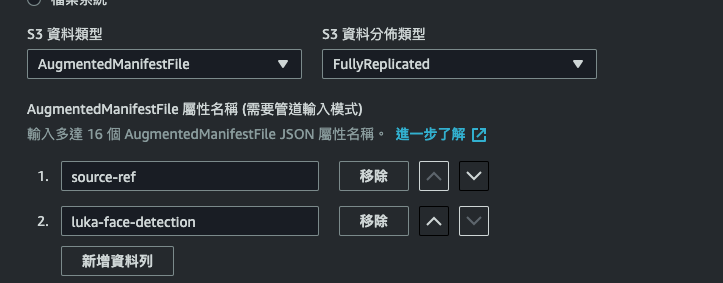

# Sagemaker 快速訓練/部署模型

使用到的功能：
1. Notebook Instance
2. Ground Truth (用來標記資料)
3. Training jobs (訓練及建立模型)
4. 

## 資料（準備，前處理，標記，儲存）

### 資料準備

直接把準備好的資料放到 S3，等等標記時指向 S3 即可。

可以參考以下的官方範例：
<details><summary>官方範例</summary>
建立一個 Notebook Instance（或其他可以 access 到 aws 的環境，包含local terminal、local python file 等等，只要可以 access 都可以）

以 Sagemaker Notebook Instance 為例，建立 notebook instance 後，開啟一個 .ipynb file，執行以下程式，正常執行後即把資料 download 到 S3 了。
```python
import sagemaker

sess = sagemaker.Session()
bucket = sess.default_bucket()

!aws s3 sync s3://sagemaker-sample-files/datasets/image/caltech-101/inference/ s3://{bucket}/ground-truth-demo/images/

print('Copy and paste the below link into a web browser to confirm the ten images were successfully uploaded to your bucket:')
print(f'https://s3.console.aws.amazon.com/s3/buckets/{bucket}/ground-truth-demo/images/')

print('\nWhen prompted by Sagemaker to enter the S3 location for input datasets, you can paste in the below S3 URL')

print(f's3://{bucket}/ground-truth-demo/images/')

print('\nWhen prompted by Sagemaker to Specify a new location, you can paste in the below S3 URL')

print(f's3://{bucket}/ground-truth-demo/labeled-data/')
```
</details>

或手動把資料放入 S3：
1. 我們上網隨便搜尋 5 張包含人臉的照片，以存於[這邊](../data/)。
2. 把這 5 張包含人臉的照片放入指定的 S3（這裡不多做介紹，自己放進自己帳號的 S3 bucket，只要記得放在哪即可）

### 資料標記

#### Ground Truth -> Labeling jobs -> Create labeling jobs

選擇預先建立好的 S3 位置，任務類型選擇 bounding box。

**任務描述類型請詳盡清楚，後續 AWS 將會派遣人力資源幫你標記。**

預設是 5 個人力幫忙標記資料，計價方式假設是以此例子來做說明：
- 資料筆數: 5 份
- 審查費用區間: 5 筆資料 < 50000，因此費用為 0.08 USD
- 任務費用: 0.036 USD/每份資料
  
因此本次任務的費用為：任務費用＋審查費用（必須）
- 任務費用 = 0.036 * 5 (5 張圖片) * 5 (5 個標籤人員) = 0.9
- 審查費用 = 0.08 * 5 (5 張圖片，若超過 50000 張圖片，則多的圖片以 0.04 計價) = 0.4
- 總共 = 0.9 + 0.4 = 1.3 （換算成台幣約為40元）

計價表：https://aws.amazon.com/tw/sagemaker/data-labeling/pricing/

標記完後選擇「輸出資料及位置」，即可看到標記完資料儲存的 S3 位置，點選：manifests/output/output.manifest，此為 output 的 JSON Lines 格式的輸出資料。

--- 

## 模型訓練

Sagemaker ML 任務整體服務框架如下：


將資料準備好後，我們即可開始訓練模型，Sagemaker 可選擇的訓練模型方式是：
1. 使用內建演算法（基本任務都有，基本上只要是來自 Ground Truth 標記完的資料都能無痛串接，最快最方便）
2. 自定義演算法（較為客製化的訓練方式，例如串接 LoRA 等等模塊）
3. 自己準備 Container（按照 Sagemaker 準備好後，放到 ECR，[參考](https://docs.aws.amazon.com/zh_tw/sagemaker/latest/dg/docker-containers.html）
4. 其他內建演算法

在 Sagemaker 主控台左側，選擇「培訓」->「訓練任務」->「建立訓練任務」


在[這邊](https://docs.aws.amazon.com/zh_tw/sagemaker/latest/dg/algos.html)找到最適合的演算法或業務情境，決定是否使用內建的演算法，或是自己建立訓練演算法，以物件偵測為例，參考[這邊](https://docs.aws.amazon.com/zh_tw/sagemaker/latest/dg/object-detection.html)會詳細說明所需要的 input 格式。**因此針對個案，每次建立新的訓練任務，都要閱讀官方提供的資料格式。**

### 設定參數部分


1. 這裡使用 Sagemaker 內建的演算法：Vision - Object Detection (MxNet)
2. 往下拉看到「輸入資料組態」內的設定如下：
   - 這個 Channel 可以幫助區分「訓練、測試、驗證」等資料集，此範例我們只使用兩個 channel：「train」、「validation」（針對不同演算法或任務，有各自的規定）。
   - 
   - 
    - 屬性名稱「AttributeNames」，主要需要是輸入演算法的內容。
3. S3 位置則設定為使用 Ground Truth 標記完的 output.manifest 位置（確保此檔案的 key 能正確對應到上圖的 AttributeNames）。
4. 「紀錄包裝函式」RecordWrapperType 選擇「RecordIO」

更多詳細的選項說明可以參考[這邊](https://docs.aws.amazon.com/zh_tw/sagemaker/latest/dg/augmented-manifest.html)


其他參數我並沒有做太大的變動，這個[部落格](https://aws.amazon.com/tw/blogs/machine-learning/accelerate-model-training-using-faster-pipe-mode-on-amazon-sagemaker/)有提供 Pipe 的說明，可以再做參考，之後建立訓練後就等於直接開始跑訓練了。

回到此任務 -> 狀態 -> 檢視歷史紀錄，出現以下畫面就代表成功了！


失敗的話可以從 Cloudwatch 或是 [這邊](https://docs.aws.amazon.com/sagemaker/latest/dg/clarify-processing-job-run-troubleshooting.html)細查原因。


訓練指標可以參考頁面往下（CloudWatch），可以看到一些評估指標，點進 log 也可以看到 loss 等等資訊。

---

## 模型部署

在 Sagemaker 中，想要部署模型到雲端，可使用「endpoint」，整體服務概念如下：


基本上可以大致把整個 Serving 流程想像成：客戶向雲端發出請求 -> 通過 GateWay 整合請求來導向不同的雲端服務 (管理、整合、過濾不同請求) -> 觸發 Lambda 後會轉發給 Sagemaker 模型做推論 -> Sagemaker 的 Autoscaling 會根據 Lambda 的請求流量來自動擴增縮減計算資源（越多請求擴增越多計算資源）-> 推論完後再由 Lambda, Gateway 回傳給客戶模型預測的結果。

接著，我們就可以從上述訓練好的模型進行推論。模型一樣會預設存在 s3 上。而點選右上角「建立模型」，建立完後選擇「建立端點」。


### 模型推論


---

## 模型推論

---

## 討論

1. 標記任務：這部分需要依靠 Sagemaker 所提供的人力、標記軟體等等，後續可研究：「如何在自己的標記環境中，自行進行標記作業，將標記結果串接回來，進行後續的模型訓練」，如此便能提供更客製化的標記作業與流程，並降低成本。
2. 模型訓練：我們所使用的是 Sagemaker 內建演算法，可以研究如何使用自訂義演算法做訓練。


### Remark

1. 業務問題清楚定義後，應先評估訓練模型的標記成本，再選擇是否使用 AWS 的標記方案（可用 few-shot 簡單實測模型成效）
2. 若快速建立訓練任務（使用內建方案），需要針對個別方案決定輸入格式。
3. 內建方案清單：https://docs.aws.amazon.com/zh_tw/sagemaker/latest/dg/algos.html
4. 自己包 container 記得實作 `server()` function，可參考[這裡](https://www.youtube.com/watch?v=YQyid2uLOvI)
## 總結


---
## 參考

1. 資料標記：https://aws.amazon.com/tw/getting-started/hands-on/machine-learning-tutorial-label-training-data/
2. 使用 Ground Truth 標記資料訓練：https://aws.amazon.com/tw/blogs/machine-learning/easily-train-models-using-datasets-labeled-by-amazon-sagemaker-ground-truth/
3. Sagemaker 演算法：https://docs.aws.amazon.com/zh_tw/sagemaker/latest/dg/algorithms-choose.html
4. Sagemaker 訓練任務：https://docs.aws.amazon.com/zh_tw/sagemaker/latest/dg/how-it-works-training.html
5. Sagemaker 建立端點：https://docs.aws.amazon.com/sagemaker/latest/APIReference/API_CreateEndpoint.html


## 待讀
1. 流量測試：https://aws.amazon.com/tw/blogs/machine-learning/load-test-and-optimize-an-amazon-sagemaker-endpoint-using-automatic-scaling/