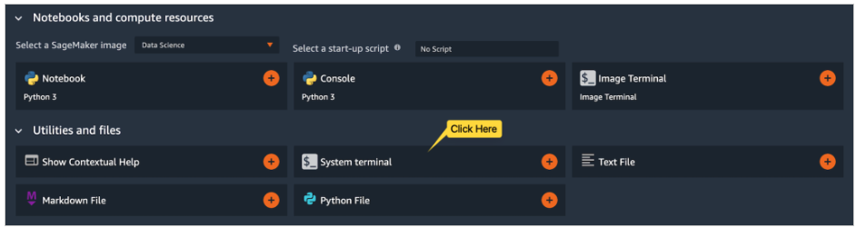

# 如何連接 sagemaker studio 到 vscode 上

## 1. 建立 Vscode 環境

1. 點選 **System terminal**



2. 在 Terminal 上，輸入以下指令：

```Shell
curl -LO https://github.com/aws-samples/amazon-sagemaker-codeserver/releases/download/v0.1.5/amazon-sagemaker-codeserver-0.1.5.tar.gz
tar -xvzf amazon-sagemaker-codeserver-0.1.5.tar.gz

cd amazon-sagemaker-codeserver/install-scripts/studio
 
chmod +x install-codeserver.sh
./install-codeserver.sh

```

3. 重整頁面，點選 **Code Server** 進入 vscode


*個人建議若要在上面開發，用 jupyter lab 會好一點，連到 code server 在做其他動作會很慢，extension 也很多版本要跟 code server 對應。*

### 參考
1. 建立環境：https://aws.amazon.com/tw/blogs/machine-learning/host-code-server-on-amazon-sagemaker/


